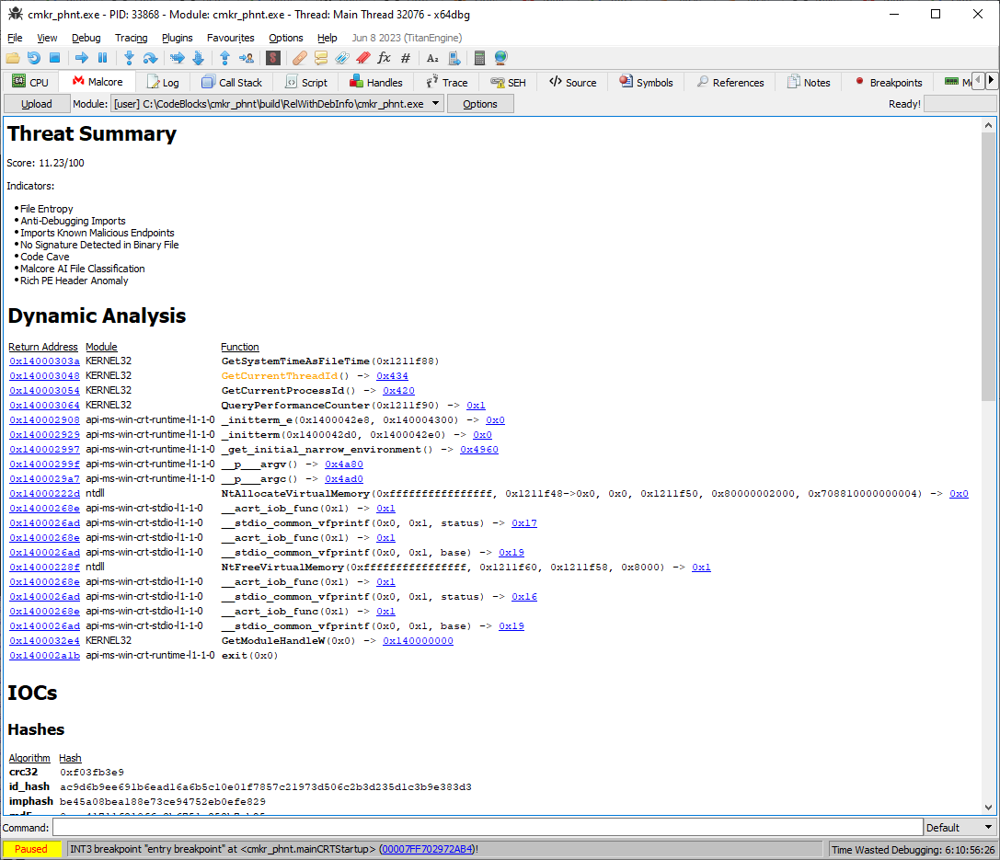

# Malcore-x64dbg

Malcore is an advanced sandbox solution that is designed with speed and scalability in mind. Most leading sandbox solutions can take multiple minutes to perform analysis on a single file, Malcore solves this problem by taking seconds where it takes minutes. This allows Malcore to scale faster and larger than leading solutions by allowing more requests per day. Where other tools fall short is where Malcore thrives.

This [x64dbg](https://source.x64dbg.com) plugin adds a tab where you can upload your sample and display the analysis results:

## Getting started

1. Download the [latest release](/releases/latest).
2. Extract the archive to your x64dbg installation directory.

## Compilation

To build this plugin, follow the [x64dbg wiki](https://github.com/x64dbg/x64dbg/wiki/Compiling-the-whole-project) to set up your Qt 5.6.3 (msvc2013) environment. Then open `src\Malcore.pro` in Qt Creator and compile it.